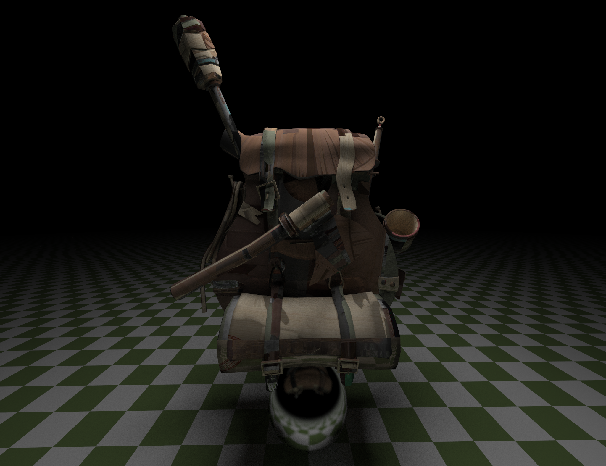

# CUDA Ray Tracer

A real-time GPU-accelerated path tracer written in C++ and CUDA, with OpenGL for display.

This is a fork of [Ancientkingg/cuda-raytracer](https://github.com/Ancientkingg/cuda-raytracer) and an experiment in using [Claude Code](https://docs.anthropic.com/en/docs/claude-code) to extend a ray tracer. The original project implemented a real-time CUDA path tracer with movable camera, temporal accumulation, BVH acceleration, and textures. This fork uses Claude Code to add new rendering features, primitives, and performance improvements on top of that foundation.



## What Claude Code added

- **OBJ model loading** with MTL material support — load Wavefront `.obj` meshes with `--obj <path>`, with automatic diffuse texture loading from the MTL file
- **Normal and specular mapping** for textured meshes, adding surface detail without extra geometry
- **Per-mesh BVH acceleration** — each loaded mesh gets its own GPU-side bounding volume hierarchy for O(log N) triangle intersection
- **Disc primitive** for physically natural area lights with uniform sampling
- **Emissive materials** for area lights (previously only sky gradient illumination)
- **Rectangle and triangle primitives** (enabling flat area lights and mesh building blocks)
- **Tiled progressive rendering** that renders the image in tiles for better GPU occupancy
- **Pixelated preview mode** with configurable scale factor for fast camera movement feedback
- **Rasterization preview mode** using OpenGL for instant feedback while moving the camera
- **Adaptive samples-per-pixel** that scales SPP dynamically to maintain a target frame rate
- **Temporal reprojection** so camera movement blends smoothly instead of resetting to full noise
- **Command-line parameters** for width, height, SPP, max depth, FOV, tile size, preview scale, and OBJ/texture paths
- **Linux build support** with automatic NVIDIA GPU selection on hybrid-GPU laptops
- **CUDA 13+ compatibility** fixes (BVH sort, MSVC conforming preprocessor, `CUDA_ARCHITECTURES native`)

## Building

Requires:
- CMake 3.24+
- CUDA Toolkit (12+ recommended, 13+ tested)
- A C++17 compiler (MSVC on Windows, GCC/Clang on Linux)
- An NVIDIA GPU

```bash
cmake --preset x64-release
cmake --build out/build/x64-release
```

## Running

```bash
cd out/build/x64-release
./cuda-raytracer --width 1280 --height 720 --samples 8 --depth 50 --fov 75
```

To load an OBJ model:
```bash
./cuda-raytracer --obj /path/to/model.obj --width 1280 --height 720
```

Diffuse textures referenced in the model's `.mtl` file are loaded automatically. You can also specify a texture explicitly with `--texture <path>`.

All parameters are optional (defaults: 800x600, 3 SPP, depth 50, FOV 90). The `--samples` value is the maximum SPP; the adaptive controller scales it down automatically if the GPU can't sustain 30 fps. Additional options include `--tile-size` (default 64) and `--preview-scale` (pixelation factor during camera movement, default 1).

### Controls

| Key | Action |
|-----|--------|
| W/A/S/D | Move horizontally |
| Space / Ctrl | Move up / down |
| Mouse | Look around |
| Q / E | Roll camera |
| Esc | Quit |

## Architecture

```
                         +-----------+
                         |  main.cpp |  Parse CLI args, create Window
                         +-----+-----+
                               |
                         +-----v-----+
                         | Window    |  GLFW window, main loop, adaptive SPP
                         +-----+-----+
                               |
                 +-------------+-------------+
                 |                           |
           +-----v-----+             +------v------+
           |   Input    |             | tick_render |  4-stage OpenGL pipeline
           +-----+------+             +------+------+
                 |                           |
     camera movement                +--------+--------+--------+
     & velocity decay               |        |        |        |
                 |               Render   Copy to  Accumulate  Display
           +-----v------+       current   blit     blend to    to
           | KernelInfo  |       frame    quad     accum FBO   screen
           | .set_camera |         |
           +-------------+   +----v----+
                             | raytrace |  CUDA kernel (per-pixel, tiled)
                             +----+-----+
                                  |
                    +-------------+-------------+
                    |             |              |
              +-----v---+  +-----v------+  +----v-------+
              | Camera  |  | FrameBuffer|  | World      |
              | get_ray |  | .color()   |  | .hit()     |
              +---------+  +-----+------+  +-----+------+
                                 |               |
                           recursive         +---v---+
                           bounce loop       |  BVH  |  AABB tree traversal
                                 |           +---+---+
                    +------------+---+           |
                    |            |   |      +----+----+----+----+----+
               on hit:      on miss:  max  |    |    |    |    |    |
               emit +       sky      depth | Sphere Rect Disc Mesh  ...
               scatter      gradient       +----+----+----+-+--+----+
                    |                                      |
              +-----v--------+                     +-------v--------+
              |  Materials   |                     |  TriangleMesh  |
              | Lambertian   |                     |  per-mesh BVH  |
              | Metal        |                     |  (MeshBVHNode) |
              | Dielectric   |                     +----------------+
              | Emissive     |
              +--------------+
              | Textures:    |
              | Solid, Image |
              | Checker,     |
              | Normal map,  |
              | Specular map |
              +--------------+

OBJ loading pipeline:
  --obj flag -> ObjLoader (tinyobjloader) -> Mesh (host)
            -> MeshBVHBuilder -> per-mesh BVH (host)
            -> cudaMalloc + memcpy -> TriangleMesh (device)

Accumulation shader (GLSL):
  Static camera  -> progressive blend toward converged image (up to 500 frames)
  Moving camera  -> exponential blend (20% new / 80% old) to reduce ghosting
```

### Source layout

```
src/
  main.cpp                  Entry point, CLI argument parsing
  Window.cpp/.h             GLFW window, main loop, adaptive SPP, temporal blend
  Input.cpp/.h              Keyboard/mouse input, camera velocity
  Quad.cpp/.h               OpenGL quad with PBO for CUDA-GL interop
  Shader.h                  OpenGL shader loader
  ShaderManager.cpp/.h      Manages OpenGL shader programs
  GLTexture.cpp/.h          OpenGL texture loading (stb_image)
  ObjLoader.cpp/.h          Wavefront OBJ/MTL loader (tinyobjloader)
  Mesh.cpp/.h               Host-side indexed triangle mesh
  MeshBVHBuilder.cpp/.h     Builds per-mesh BVH on the host for GPU upload
  Scene.cpp/.h              Scene description and management
  Rasterizer.cpp/.h         OpenGL rasterization preview mode
  Picker.cpp/.h             Mouse click-and-drag object picking
  cuda_errors.cpp/.h        CUDA error checking helpers

  raytracer/
    kernel.cu/.h            CUDA kernels: raytrace, create_world, set_device_camera
    Camera.h                Camera with position, rotation, FOV
    Ray.h                   Ray struct (origin + direction)
    FrameBuffer.h           Per-pixel color computation (recursive bounce loop)
    World.h                 Scene container with optional BVH root
    BVHNode.h               Bounding volume hierarchy (AABB tree)
    MeshBVHNode.h           Per-mesh BVH node for triangle intersection
    AABB.h                  Axis-aligned bounding box (slab intersection)
    Hittable.h              Base class + HitRecord
    Sphere.h                Sphere primitive
    Rectangle.h             Quad primitive (corner + two edge vectors)
    Triangle.h              Triangle primitive (Moller-Trumbore intersection)
    Disc.h                  Disc primitive (area light with uniform sampling)
    TriangleMesh.h          GPU-side indexed triangle mesh with per-mesh BVH
    Material.h              Lambertian, Metal, Dielectric, Emissive (with normal/specular maps)
    Texture.h               SolidColor, CheckerTexture, ImageTexture

  shaders/
    rendertype_screen.*     Pass-through vertex/fragment shader
    rendertype_accumulate.* Temporal accumulation with motion-aware blending
    rasterize.*             Rasterization preview shaders
    mesh.*                  Mesh rendering shaders
```

## Original project

The original ray tracer by [Ancientkingg](https://github.com/Ancientkingg) implements the core rendering pipeline following the [Ray Tracing in One Weekend](https://raytracing.github.io/books/RayTracingInOneWeekend.html) series adapted to CUDA, with real-time display via OpenGL interop, a movable camera, BVH acceleration, and temporal frame accumulation. See the [original repository](https://github.com/Ancientkingg/cuda-raytracer) for the full development walkthrough.
